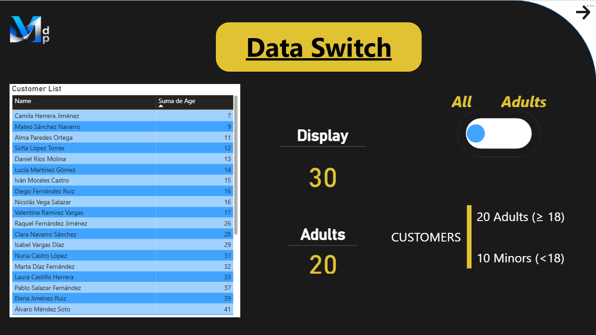
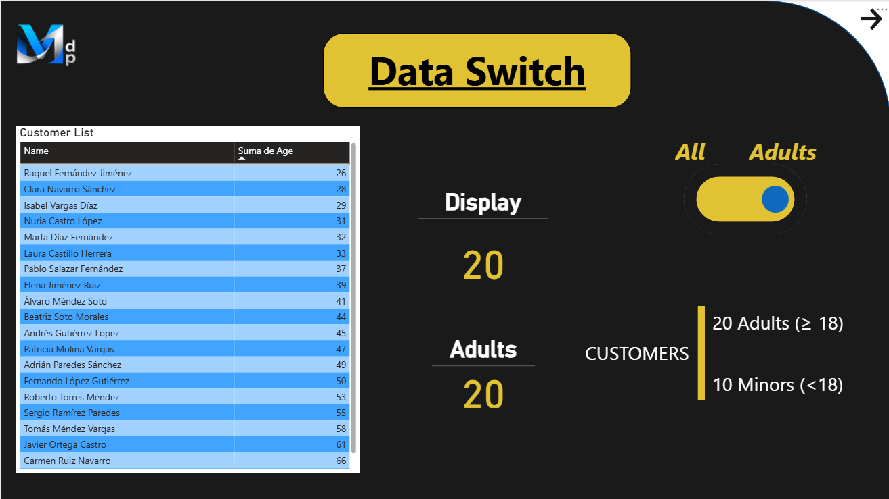

#  &nbsp;&nbsp;    📊 Power BI data toggle

## Overview

This repository serves as an index of Bussiness Inteligence related projects. It provides quick access to applications, tools, and prototypes, and will continue to grow as new projects are added.

This Power BI report demonstrates interactive filtering and dynamic metrics using a synthetic dataset of customers. The primary purpose of this report is to **showcase filter interactions and KPI updates** based on user input controls.

    The toggle is made with Power Bi's own tools, no external addons.

Key features include:  
- A **customer list** with random names and ages  
- A **toggle switch** to filter adult customers (age 18+)  
- Two **dynamic KPI counters** reflecting the filtered results

## 📁 Repository Contents

The repository includes the following files:

    📦 PBI_Toggle.pbix  - Power BI Desktop report file
    📦 README.md        - This documentation
    📁 Data/            - Data file
       └ 📦 List.csv
    📁 Images/          - Screenshots and visual assets
      ├ 📦 Github.png
      ├ 📦 ScreenShot1.png
      └ 📦 ScreenShot2.png

## 🧠 Dataset

The dataset consists of:

- **30 randomly generated customer records**, each with a name and age
- Stored and displayed in a table on the left side of the report

## 🔍 Functionality

### 📌 Toggle Filter

A toggle switch is placed on the right side of the page. When **activated**, it applies a filter to:

- Display only customers who are **18 years old or older**

### 📊 Dynamic KPIs

In the center of the report, two KPI counters are shown:

1. **Displayed Customers Counter**  
   - Shows the total number of customers currently visible
   - Updates dynamically with the toggle filter

2. **Adult Customers Counter**  
   - Displays the number of customers aged 18 or older

Both counters provide real-time feedback on the impact of the toggle state.

# Screenshot

### *Toggle Off*

### *Toggle On*

# License

This project is distributed under the **MIT License**, which allows its use, modification, and redistribution without restrictions.

Please refer to the [LICENSE](https://opensource.org/license/mit) file for more information.

# 💬 Feedback and Contributions
Have you found a bug or do you have any suggestions?

👉 Open an issue ([Issue](https://github.com/MiguelAdePablo/PortScanner/issues)) or submit a *Pull Request*.

# 🌐 Useful Links

- [Business Intelligence Index](https://github.com/MiguelAdePablo/business-intelligence)
- [General Index](https://github.com/MiguelAdePablo/Index)
